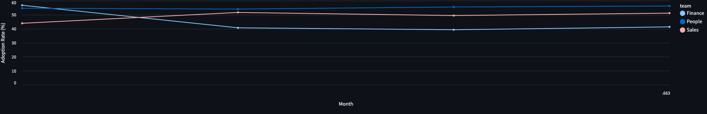
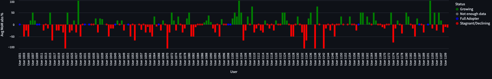

## Adoption Analysis

This readme.md summarizes the AI tool adoption and efficiency metrics following my full data analysis in `adoption_analysis.py`.

To view the [Full Dashboard]((adoption_analysis.py)):
```
streamlit run Q1_Technical_Analysis/A_Adoption_Analysis/adoption_analysis.py
```

---

### i. What percentage of tasks used the AI tool, segmented by team?

**Finance Team**

| Task Type              | Total Tasks | AI Tasks | Adoption Rate (%) |
| ---------------------- | ----------: | -------: | ----------------: |
| budget\_reconciliation |          77 |       35 |             45.45 |
| forecast\_model        |          84 |       43 |             51.19 |
| hiring\_pipeline       |          81 |       36 |             44.44 |
| quote\_builder         |          86 |       32 |             37.21 |

**People Team**

| Task Type              | Total Tasks | AI Tasks | Adoption Rate (%) |
| ---------------------- | ----------: | -------: | ----------------: |
| budget\_reconciliation |          81 |       53 |             65.43 |
| forecast\_model        |          86 |       44 |             51.16 |
| hiring\_pipeline       |          77 |       36 |             46.75 |
| quote\_builder         |          75 |       43 |             57.33 |

**Sales Team**

| Task Type              | Total Tasks | AI Tasks | Adoption Rate (%) |
| ---------------------- | ----------: | -------: | ----------------: |
| budget\_reconciliation |          93 |       50 |             53.76 |
| forecast\_model        |          94 |       45 |             47.87 |
| hiring\_pipeline       |          83 |       37 |             44.58 |
| quote\_builder         |          78 |       39 |             50.00 |

---

### ii. Which teams show the highest and lowest AI adoption rates?

| Team    | Total Tasks | AI Tasks | Adoption Rate (%) |
| :------ | ----------: | -------: | ----------------: |
| Finance |         328 |      146 |             44.51 |
| People  |         319 |      176 |             55.17 |
| Sales   |         348 |      171 |             49.14 |

* **Highest adopting team**: People (55.17%)
* **Lowest adopting team**: Finance (44.51%)

---

### iii. Identify any users or teams exhibiting stagnant or declining AI usage over time

#### a) Team-level month-over-month KPIs

| Team    | Jan (%) | Feb (%) | Mar (%) | Apr (%) | Δ abs % (Apr–Jan) | Avg MoM abs % |
| :------ | ------: | ------: | ------: | ------: | ----------------: | ------------: |
| Finance |   56.79 |   40.68 |   39.29 |   41.35 |            −15.44 |         −5.15 |
| People  |   54.67 |   54.05 |   55.56 |   56.25 |             +1.58 |         +0.53 |
| Sales   |   43.90 |   51.65 |   49.44 |   51.16 |             +7.26 |         +2.42 |



The Finance team showed a noticable drop from January to February, while People and Sales teams remained relatively stable or growing.

#### b) User-level analysis

We evaluate each user's **Avg MoM absolute % change** since their *first month of AI adoption*, in order to avoid unfairly penalizing late adopters or those with 100% initial usage.

> **Note on methodology**: We initially considered adding an auxiliary "Pre-Jan" month at 0% for all users to normalize calculations. However, this flagged every user as declining and distorted genuine patterns. Instead, we start from each user's true first-adoption month, ensuring that:
>
> * Late adopters are only compared across their active months.
> * Users with immediate full adoption (100%) aren’t incorrectly flagged as declining when they stabilize.

115 users technically 'stagnant/declining' in usage

##### Consecutively Declining Users

| User ID | Name      | Team    | First Month | Since Declines | Since Increases | Avg MoM abs % |
| ------: | :-------- | :------ | :---------: | -------------: | --------------: | ------------: |
|    1004 | User 1004 | Sales   |    Jan %    |              2 |               1 |        −25.0% |
|    1077 | User 1077 | Sales   |    Feb %    |              2 |               1 |        −33.3% |
|    1082 | User 1082 | Finance |    Jan %    |              2 |               1 |        −50.0% |
|    1146 | User 1146 | People  |    Feb %    |              2 |               1 |          0.0% |

Thirteen users meet the stricter criterion of multiple consecutive declines. To focus on the most concerning cases, I then compared these declines against each user’s runs of consecutive increases in adoption (everyone has at least one, since adoption started at 0% before January). Only four users exhibited more consecutive declines than increases—suggesting potential disengagement or a shift in their workflows.

##### Consecutively Stagnant Users

13 users are problematically stagnant for 2+ months, having never changed their usage since first adoption, of these 11 are stangant at 0% usage. Users 1118, and 1164 stagnant at 50, and 66.7% respectively. For now being less problematic cases.

Below is the table of the 11 users who have not yet adopted the AI after 2+ months of activity.

| User ID | Name      | Team    | Data Months | Jan % | Feb % | Mar % | Apr % |
| ------: | :-------- | :------ | ----------: | ----: | ----: | ----: | ----: |
|    1013 | User 1013 | Finance |           3 |  0.0% |  0.0% |  0.0% |       |
|    1034 | User 1034 | Finance |           2 |  0.0% |       |  0.0% |       |
|    1035 | User 1035 | People  |           3 |  0.0% |  0.0% |  0.0% |       |
|    1056 | User 1056 | Finance |           3 |  0.0% |  0.0% |       |  0.0% |
|    1096 | User 1096 | People  |           2 |  0.0% |  0.0% |       |       |
|    1112 | User 1112 | Finance |           3 |  0.0% |  0.0% |       |  0.0% |
|    1144 | User 1144 | People  |           2 |  0.0% |  0.0% |       |       |
|    1149 | User 1149 | Finance |           2 |  0.0% |       |       |  0.0% |
|    1155 | User 1155 | People  |           3 |  0.0% |       |  0.0% |  0.0% |
|    1156 | User 1156 | Finance |           2 |  0.0% |  0.0% |       |       |
|    1171 | User 1171 | Sales   |           3 |  0.0% |  0.0% |  0.0% |       |

These users have shown no AI usage in at least two months since introduction, highlighting candidates for targeted training or outreach.

> **Totals**: While 115 users are technically 'stagnant/declining'; 102 users have at least one month of decline (mostly one-month anomalies), and 13 users meet the stricter criterion of multiple consecutive declines. 13 users are problematically stagnant (never changed usage), of which 11 have 0% usage.

Below shows a bar chart of each users average month of month adoption chance since they first picked up the AI tooling:



And the full user table, "Users: Monthly Adoption Δ-Metrics (Jan–Apr 2025)", can be viewed in the [dashboard.](adoption_analysis.py)

> **Note:** It would also be important to evaluate this in conjunction with AI quality, as AI quality could be the reason why someone is stagnating or declining in their usage.


---

**Next Steps & Recommendations**

1. **Monitor** the 4 + 13 users with multiple consecutive stagnations/declines before flagging them as issues, to distinguish anomalies from true disengagement.
2. **Targeted support** If trend continues for the 13 consecutively stagnant users or emerges significantly for other users—consider reaching out to see if there are any issues - roadblocks, or personal motivations against, and can offer personalized training sessions.
3. **Re-evaluate** adoption metrics quarterly, ensuring methodology remains fair to late adopters and full initial adopters.


---

