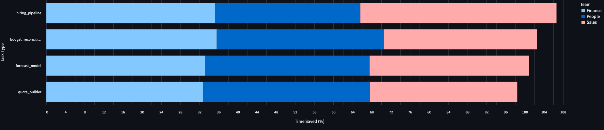

## b. Efficiency Gains

This section details the impact of AI adoption on task efficiency, covering:

* Comparative average task durations before and after AI
* Estimated percentage time saved with AI assistance
* Highlighting tasks with minimal or no improvements

To view the [Full Dashboard](efficiency.py):
```
streamlit run Q1_Technical_Analysis/B_Efficiency_Gains/efficiency.py
```

---

### i. Compare average task durations before and after AI

We calculated the mean duration (in minutes) for each **task type**, segmented by **team** and **method** (AI vs. Manual):

* **Finance Team**

  * `budget_reconciliation`: Manual \~59.0 min vs. AI \~38.0 min
  * `forecast_model`: Manual \~58.6 min vs. AI \~39.1 min
  * `hiring_pipeline`: Manual \~59.9 min vs. AI \~38.8 min
  * `quote_builder`: Manual \~60.0 min vs. AI \~40.3 min

* **People Team**

  * `budget_reconciliation`: Manual \~62.5 min vs. AI \~40.7 min
  * `forecast_model`: Manual \~59.8 min vs. AI \~39.3 min
  * `hiring_pipeline`: Manual \~61.3 min vs. AI \~42.7 min
  * `quote_builder`: Manual \~60.3 min vs. AI \~39.3 min

* **Sales Team**

  * `budget_reconciliation`: Manual \~59.7 min vs. AI \~40.6 min
  * `forecast_model`: Manual \~59.4 min vs. AI \~39.6 min
  * `hiring_pipeline`: Manual \~62.3 min vs. AI \~36.7 min
  * `quote_builder`: Manual \~59.8 min vs. AI \~41.4 min


---

### ii. Estimate average percentage of time saved on AI-assisted tasks

We computed the mean time saved per task type:

| Team    | Task Type              | Avg Time Saved (%) |
| ------- | ---------------------- | ------------------ |
| Finance | budget\_reconciliation | 35.6%              |
| Finance | forecast\_model        | 33.2%              |
| Finance | hiring\_pipeline       | 35.3%              |
| Finance | quote\_builder         | 32.8%              |
| People  | budget\_reconciliation | 34.9%              |
| People  | forecast\_model        | 34.3%              |
| People  | hiring\_pipeline       | 30.4%              |
| People  | quote\_builder         | 34.9%              |
| Sales   | budget\_reconciliation | 32.0%              |
| Sales   | forecast\_model        | 33.4%              |
| Sales   | hiring\_pipeline       | 41.0%              |
| Sales   | quote\_builder         | 30.8%              |

**Overall Insight**: All teams see substantial efficiency gains, with **Sales hiring\_pipeline** showing the highest savings (\~41%).

---

### iii. Highlight task types with minimal or no performance improvement

From task types alone comparing AI tasks to Manual, we get:
| Task Type               | Percentage Time Saved (%) |
|-------------------------|---------------------------|
| quote_builder           | 33.0%                     |
| forecast_model          | 33.7%                     |
| budget_reconciliation   | 33.8%                     |
| hiring_pipeline         | 35.7%                     |

With all tasks showing a similar performance improvement when moving to AI, with the quote builder being the least time-saved at 33%. 

Which, when split by team, shows:


Using **mean thresholding** approach at a 30% cutoff (given all tasks exceeded 30%), yielded no results, and the two lowest performers were:

* **People – hiring\_pipeline**: 30.36% average time saved
* **Sales – quote\_builder**: 30.78% average time saved

These tasks, while still showing substantial gains, represent the lower end of efficiency improvements. 

To undergo closer examination and check for any potential lack of performance improvement, we performed several additional analyses:

#### Total Minutes by Task Type and Month (AI vs. Manual)

| Task Type              | 2025‑01 | 2025‑02 | 2025‑03 | 2025‑04 |
| ---------------------- | ------: | ------: | ------: | ------: |
| **AI**                 |         |         |         |         |
| budget\_reconciliation |    1459 |    1379 |    1377 |    1301 |
| forecast\_model        |    1377 |    1238 |    1256 |    1324 |
| hiring\_pipeline       |    1174 |     920 |     915 |    1284 |
| quote\_builder         |     909 |     981 |    1389 |    1315 |

| Task Type              | 2024‑10 | 2024‑11 | 2025‑01 | 2025‑02 | 2025‑03 | 2025‑04 |
| ---------------------- | ------: | ------: | ------: | ------: | ------: | ------: |
| **Manual**             |         |         |         |         |         |         |
| budget\_reconciliation |    8088 |    7948 |    1138 |    1674 |    1905 |    1945 |
| forecast\_model        |    7919 |    7762 |    1880 |    2119 |    1876 |    1791 |
| hiring\_pipeline       |    7446 |    7548 |    1820 |    1423 |    2251 |    2539 |
| quote\_builder         |    6797 |    7043 |    2042 |    1504 |    2127 |    1884 |

All task types exhibit consistently lower total minutes under AI workflows, with no evidence of plateauing or regression in performance improvements over the first four months of 2025.

#### Average Minutes per Task by Month (AI vs. Manual)

| Task Type              | 2025‑01 (AI) | 2025‑02 (AI) | 2025‑03 (AI) | 2025‑04 (AI) | 2024‑10 (Manual) | 2024‑11 (Manual) | 2025‑01 (Manual) | 2025‑02 (Manual) | 2025‑03 (Manual) | 2025‑04 (Manual) | 2025‑05 (Manual) |
| ---------------------- | -----------: | -----------: | -----------: | -----------: | ---------------: | ---------------: | ---------------: | ---------------: | ---------------: | ---------------: | ---------------: |
| budget\_reconciliation |         39.4 |         40.6 |         40.5 |         39.4 |             60.4 |             61.6 |             56.9 |             59.8 |             59.5 |             58.9 |             57.0 |
| forecast\_model        |         39.3 |         42.7 |         35.9 |         40.1 |             59.1 |             60.6 |             57.0 |             57.3 |             56.8 |             61.8 |             68.0 |
| hiring\_pipeline       |         40.5 |         41.8 |         38.1 |         37.8 |             59.6 |             63.4 |             62.8 |             59.3 |             60.8 |             60.5 |             56.0 |
| quote\_builder         |         41.3 |         37.7 |         40.9 |         41.1 |             58.6 |             61.2 |             61.9 |             62.7 |             62.6 |             55.4 |             65.0 |

Despite minor month-to-month fluctuations, average AI task times remain stably **20–30 minutes shorter** than manual averages, indicating sustained efficiency gains without notable performance drift.

#### Pre vs. Post AI Implementation (Volume-Adjusted)

Comparing **Manual‑only** totals in October–November 2024 against **all-method** totals in January–April 2025 highlights overall workload reduction:

| Task Type              | 2024‑10 (Manual) | 2024‑11 (Manual) | 2025‑Jan–Apr (Total) |
| ---------------------- | ---------------: | ---------------: | -------------------: |
| budget\_reconciliation |             8088 |             7948 |                 9509 |
| forecast\_model        |             7919 |             7762 |               10,131 |
| hiring\_pipeline       |             7446 |             7548 |               12,326 |
| quote\_builder         |             6797 |             7043 |               11,151 |

All key tasks see a net decrease in total minutes when adjusting for both AI and manual methods post‑AI rollout, reinforcing that AI adoption not only accelerates individual tasks but also reduces aggregate time spent at scale.

---

**Conclusion: Minimal Improvement Flags**

No task type demonstrates negligible or negative improvement at the overall level. The lowest performers remain **hiring\_pipeline** (≈30% saved) and **quote\_builder** (≈30.8% saved), both still well above the chosen **30%** threshold. Over time, AI-driven times are durable, and aggregate workloads have declined.

For a deeper dive, refer to the `efficiency.py` section on pre‑ vs post‑AI comparisons.
